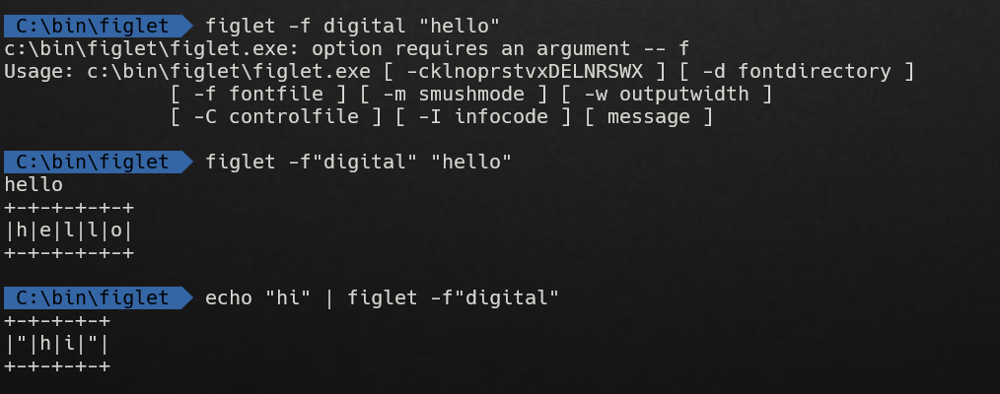
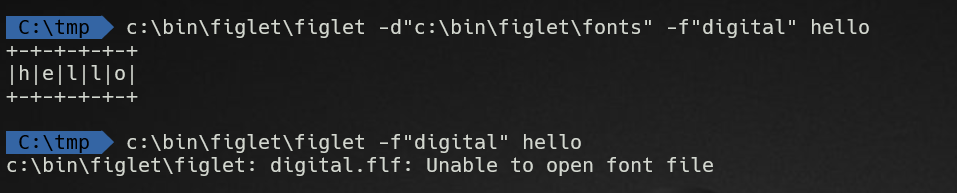

Figlet for Windows
==================

 

What is Figlet?
---------------

https://en.wikipedia.org/wiki/FIGlet

 

Figlet for Windows?
-------------------

The binary is from https://sourceforge.net/projects/figlet-for-windows/

(Tested and it works in Windows 11 cmd environment.)

 

The actual DOS version can be downloaded from the actual figlet.org site -
http://ftp.figlet.org/pub/figlet/program/ms-dos/, but it doesn't work properly
on Windows 11 cmd terminal. It seems like it's actually for real old DOS. I have
included the files from the site here, `figlet-dos.zip`

 

What is this repository for then?
---------------------------------

-   It’s to add *this* README note to show how to use Figlet for Windows
    properly.

-   Added wrapper batch file.

-   Linux man page is included in this folder: `figlet-linux-manpage.txt`

 

Usage
-----

*This is usage information was displayed when it’s misused.*

~~~~~~~~~~~~~~~~~~~~~~~~~~~~~~~~~~~~~~~~~~~~~~~~~~~~~~~~~~~~~~~~~~~~~~~~~~~~~~~~
Usage: c:\bin\figlet\figlet.exe [ -cklnoprstvxDELNRSWX ] [ -d fontdirectory ] 
              [ -f fontfile ] [ -m smushmode ] [ -w outputwidth ]
              [ -C controlfile ] [ -I infocode ] [ message ]
~~~~~~~~~~~~~~~~~~~~~~~~~~~~~~~~~~~~~~~~~~~~~~~~~~~~~~~~~~~~~~~~~~~~~~~~~~~~~~~~

 

Example use
-----------

 

### Note

-   Figlet looks for font name ends with `.flf`

-   Let say, figlet is placed in `c:\bin\figlet` along with fonts in
    `c:\bin\figlet\fonts`

 

### Calling directly

These example will work if it's run in `c:\bin\figlet` directory:  
`figlet -f"digital" "hello" echo "hi" | figlet -f"digital"`

 

If called from another directory, `c:\bin\tmp`, then it must be called like
this:  
`c:\bin\figlet\figlet -d"c:\bin\figlet\fonts" -f"digital" hello`

 

 

### Using DOSKEY alias

If preferred, use doskey alias:

`doskey /macro:fig=c:\bin\figlet\figlet.exe -d"c:\bin\figlet\fonts" $*`

 

### Batch

A small wrapper batch file `figlet.bat` is included.  Place it in where it's
already added to PATH.
